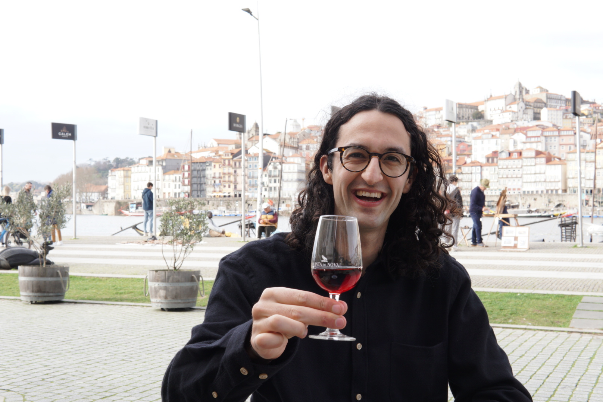
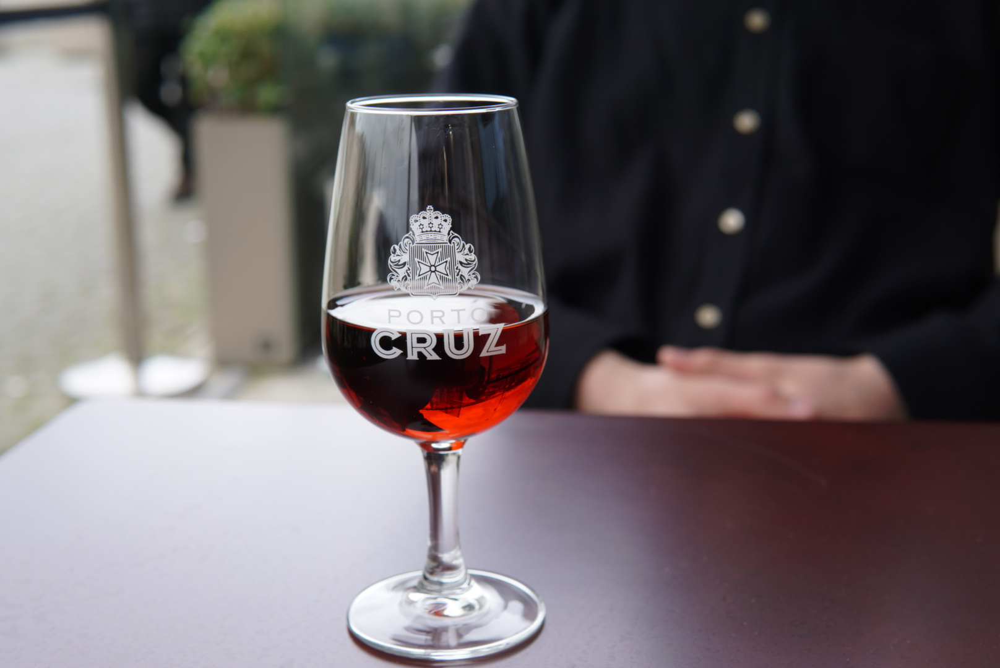
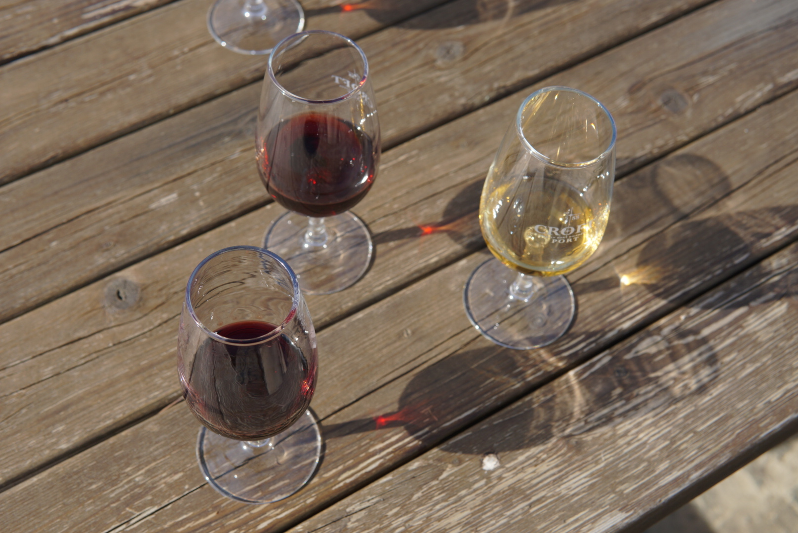
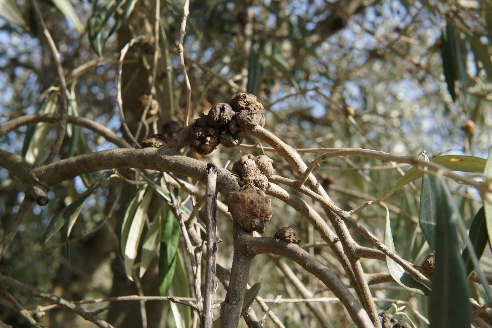
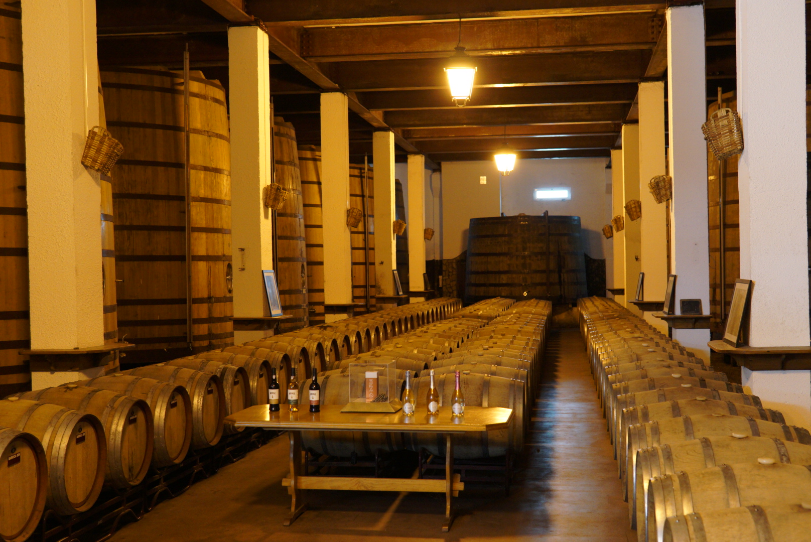
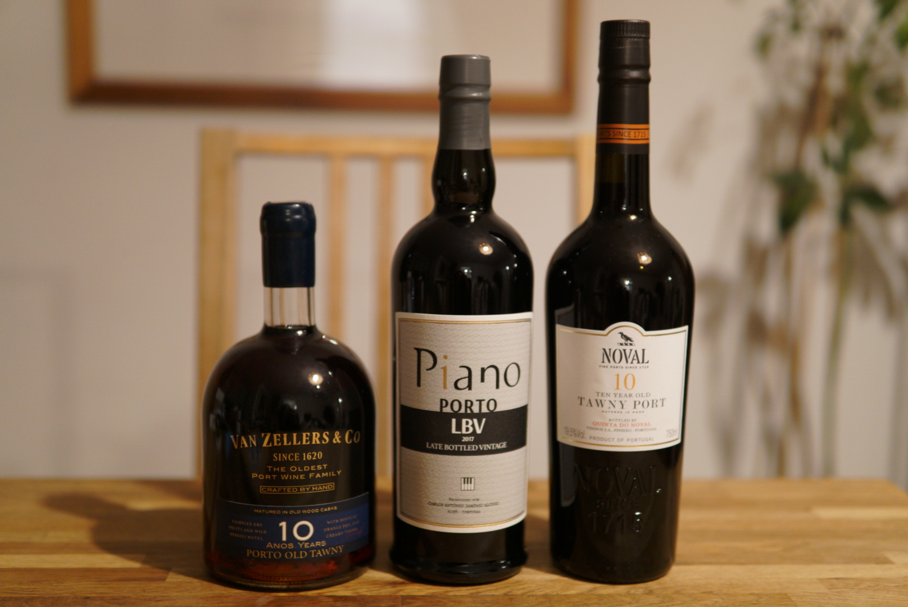

We saw some of Porto before crossing over to Villa Nova de Gaia to visit some of the port houses, which have river-front bars. First we stopped for at **Quinta De Noval** for a **10 year tawny**. We thought this had a particularly nice silky, melt-in-your-mouth quality and would end up buying a bottle to take home.

*Quinta De Noval 10 year tawny.*

The next stop was **Porto Cruz**, where we had another **10 year tawny**.

*Porto Cruz 10 year tawny.*

And to finish off the day...

*A selection of Portuguese cheeses.*

We left early the following morning to tour the Duoro valley. Our first stop was at **Croft's estate**, where we had a **white port, ruby** and **reserve tawny**.

*Croft white, ruby and reserve tawny.*

*A fungus is causing problems for the estate's vines and olive trees.*

Then we went further up the valley to a cooperative that specialises in Moscatel, a fortified wine made using the same process as port, but using a different graph variety giving it a distinct character and lighter colour. We visited a cellar where the wines including Moscatel and Port are aged.

*That's a lot of port.*

Before our flight home, we went to a wine shop to buy some bottles to take back on the plane.

*The haul brought home*